<!-- ===================== HEADER ===================== -->

 

 

<!-- ===================== ABOUT ===================== -->
## 👋 About Me

I am a **Senior Software Engineer, AI Engineer, cybersecurity practitioner and technology consultant** focused on designing and delivering **secure, scalable and practical** digital systems.

My work sits at the intersection of **software engineering · artificial intelligence · cybersecurity · cloud infrastructure · digital transformation**, solving real operational problems across **healthcare, logistics, commerce, education, enterprise operations and the public sector**.

I turn complex business processes into reliable software products that run under real African conditions: variable connectivity, cost pressure and the need to scale.

| 🧑‍💻 **Engineering** | 🤖 **Intelligence** | 🔐 **Security** | ☁️ **Infrastructure** |
|:---:|:---:|:---:|:---:|
| Full-stack · Mobile Multi-tenant SaaS | LLMs · Agents RAG · Automation | Secure architecture Threat-aware design | Cloud · DevOps CI/CD · Linux |

| 🏥 **Healthcare** | 🚚 **Logistics** | 🛒 **Commerce** | 🎓 **Education** |
|:---:|:---:|:---:|:---:|
| Clinical & EMS systems | Freight & mobility | Marketplaces & payments | School & e-learning |

<!-- ===================== PHILOSOPHY ===================== -->
## 🧠 Engineering Philosophy

> ### 💡 *Build useful things. Build them securely. Make them reliable.*

<table>
<tr>
<td width="50%" valign="top">

🔵 **01** · Understand the real-world problem 
🔵 **02** · Design the system before scaling the implementation 
🔵 **03** · Build secure foundations from day one 
🔵 **04** · Keep architecture maintainable and observable 
🔵 **05** · Automate repetitive operational work

</td>
<td width="50%" valign="top">

🟣 **06** · Use AI where it creates measurable value 
🟣 **07** · Design for real users, not ideal environments 
🟣 **08** · Measure reliability, performance and impact 
🟣 **09** · Iterate continuously 
🟣 **10** · Ship production-ready software

</td>
</tr>
</table>

<!-- ===================== TECH STACK ===================== -->
## 🛠️ Technology Stack

**Languages** 

**Frontend & Mobile** 

**Backend & Data** 

**Cloud & DevOps** 

**AI & Automation** 

<!-- ===================== CORE AREAS ===================== -->
## 🚀 Core Engineering Areas

<table>
<tr>
<td width="50%" valign="top">

### 🔵 Software Engineering
`TypeScript` `JavaScript` `React` `Next.js` `Node.js` `PHP / Laravel` `Python` `Dart / Flutter` `REST APIs` `Microservices` `Event-driven` `PostgreSQL` `Supabase` `Multi-tenant SaaS`

</td>
<td width="50%" valign="top">

### 🟣 AI Engineering
`LLM integrations` `AI agents` `Agentic workflows` `RAG` `AI automation` `Meeting intelligence` `Speech-to-text` `Document intelligence` `AI-powered search` `Classification & prediction` `API orchestration` `Open-source & hosted LLMs`

</td>
</tr>
<tr>
<td width="50%" valign="top">

### 🔴 Cybersecurity
`Secure SDLC` `AuthN & AuthZ` `RBAC` `API security` `Tenant isolation` `Secrets management` `Input validation` `Secure DB design` `Audit logging` `Threat-aware architecture` `Hardening` `Least privilege` `Security monitoring`

</td>
<td width="50%" valign="top">

### 🟢 Cloud & Infrastructure
`AWS` `Azure` `DigitalOcean` `Vercel` `Supabase` `GitHub Actions` `Linux` `Docker` `CI/CD` `DNS & Cloudflare` `VPS` `Production deployment` `Backup & recovery`

</td>
</tr>
</table>

<!-- ===================== PROJECTS ===================== -->
## 🏗️ Selected Projects

| Project | Domain | Description | Stack |
|:--|:--:|:--|:--:|
| 🔐 [**fallow-ai-security**](https://github.com/nakisisageorge/fallow-ai-security) |   | AI-enhanced security analysis with LLM-specific rules, compliance reporting, and AI verification |   |
| 🏥 [**QFlow Simulator**](https://github.com/nakisisageorge/qflow-simulator) |  | Smart virtual queue simulation and patient-flow management |  |
| 🏛️ [**PTAAU Hub**](https://github.com/nakisisageorge/ptaau-hub) |  | Digital platform for a national association |  |
| 🚨 [**Health Hazard Communication System**](https://github.com/nakisisageorge/ENHANCED-COMMUNICATION-SYSTEM-FOR-EFFECTIVE-HEALTH-HAZARD-PREPAREDNESS-AND-CONTAINMENT) |  | Real-time health-hazard communication and stakeholder coordination |  |
| 🩺 [**Ascendmend**](https://github.com/nakisisageorge/asecendmend) |  | Clinical and healthcare platform frontend |   |

### 🔒 Private / Production Engineering

<table>
<tr>
<td>🚑 Emergency medical services & ambulance operations</td>
<td>🏥 Healthcare & clinical management</td>
<td>🚚 Freight forwarding & logistics intelligence</td>
</tr>
<tr>
<td>🤖 AI-powered meeting intelligence</td>
<td>🧠 AI workflow automation</td>
<td>🏫 School management & e-learning</td>
</tr>
<tr>
<td>🛍️ Digital commerce & marketplaces</td>
<td>📱 Multi-sided delivery applications</td>
<td>💼 CRM & enterprise management</td>
</tr>
<tr>
<td>📺 Digital signage</td>
<td>💰 Financial & SACCO platforms</td>
<td>🔐 Security-sensitive institutional systems</td>
</tr>
</table>

<!-- ===================== AI ===================== -->
## 🤖 AI Engineering

I focus on **applied AI**: improving existing products and operational workflows rather than treating AI as a standalone feature. The goal is AI that is **useful, measurable, controllable and secure**.

```mermaid
flowchart LR
    A[LLM Apps] --> B[AI Agents] --> C[Knowledge Retrieval] --> D[Workflow Automation]
    D --> E[Prediction and Classification] --> F[Speech and Meeting Intelligence] --> G[Decision Support] --> H[Human-in-the-Loop]
    style A fill:#7C3AED,color:#fff,stroke:none
    style B fill:#6D28D9,color:#fff,stroke:none
    style C fill:#4F46E5,color:#fff,stroke:none
    style D fill:#2563EB,color:#fff,stroke:none
    style E fill:#0891B2,color:#fff,stroke:none
    style F fill:#0D9488,color:#fff,stroke:none
    style G fill:#059669,color:#fff,stroke:none
    style H fill:#16A34A,color:#fff,stroke:none
```

**Typical architecture:** `LLM APIs` · `Prompt orchestration` · `Structured outputs` · `Embeddings & vector search` · `Tool / function calling` · `Agent workflows` · `Speech recognition` · `Document processing` · `Human approval` · `Monitoring & evaluation`

<!-- ===================== SECURITY ===================== -->
## 🔐 Security by Design

Security is an **architectural concern**, not something added after development.

`Secure authentication` `RBAC / ABAC` `API hardening` `Session management` `Row-level security` `Secrets management` `Audit trails` `Rate limiting` `Secure file handling` `Least privilege` `Dependency awareness` `Secure deployment`

<!-- ===================== CLOUD ===================== -->
## ☁️ Cloud & DevOps

I work across the full application lifecycle:

`Cloud architecture` `VPS deployment` `Linux administration` `DNS` `SSL/TLS` `Cloudflare` `GitHub Actions` `Docker` `Database management` `Production troubleshooting` `Backup strategies` `Environment management` `Performance optimization`

<!-- ===================== AFRICA ===================== -->
## 🌍 Building for Africa

Technology in Africa requires more than reproducing systems designed for other markets. I build platforms that account for:

<table>
<tr>
<td>📱 Mobile-first users</td>
<td>📶 Variable connectivity</td>
<td>💸 Cost-sensitive infrastructure</td>
</tr>
<tr>
<td>💳 Mobile money ecosystems</td>
<td>🏦 Local payment systems</td>
<td>💬 SMS & USSD workflows</td>
</tr>
<tr>
<td>🗣️ Multi-language environments</td>
<td>🐢 Low-bandwidth scenarios</td>
<td>🌐 Distributed operations</td>
</tr>
<tr>
<td>🏪 Small & medium enterprises</td>
<td>🏛️ Public-sector requirements</td>
<td>📈 Fast-growing digital markets</td>
</tr>
</table>

> ### 🎯 *Build technology that works in the environments where people actually use it.*

<!-- ===================== DOMAINS & PRIORITIES ===================== -->
## 🎯 Domain Expertise

| | Domain | Focus |
|:--:|:--|:--|
| 🏥 | **Healthcare** | Digital health platforms, emergency response, patient workflows, clinical systems, healthcare operations |
| 🚚 | **Logistics** | Freight operations, delivery platforms, mobility systems, tracking, operational intelligence |
| 🛒 | **Commerce** | Marketplaces, e-commerce, merchant systems, payments, multi-sided platforms |
| 🎓 | **Education** | School management, learning platforms, digital training, institutional systems |
| 🏢 | **Enterprise** | CRM, ERP-style platforms, workflow automation, reporting, business intelligence |
| 🏛️ | **Public Systems** | Stakeholder coordination, communication platforms, data systems, operational digitization |

### 📈 Engineering Priorities

<!-- ===================== NOW ===================== -->
## 🔬 Currently Exploring & Building

<table>
<tr>
<td width="50%" valign="top">

### 🔭 Exploring
* AI agents for enterprise workflows
* AI-powered operational intelligence
* Secure multi-tenant SaaS architecture
* Healthcare interoperability
* Real-time logistics platforms
* AI-assisted software engineering
* Cloud-native architecture
* Cybersecurity automation
* African digital infrastructure
* Intelligent business automation

</td>
<td width="50%" valign="top">

### 🔨 Building
* AI-assisted meeting intelligence and workflow automation
* Secure multi-tenant platforms for African enterprises
* Production systems that stay reliable under real-world constraints
* **fallow-ai-security** — AI-enhanced security analysis for TypeScript/JavaScript (Mode B enhancement)
  * Extended security catalogue with 8 AI/LLM-specific rules (prompt injection, agent tool misuse, LLM data exfiltration, RAG poisoning, insecure agent state, MCP tool injection, system prompt override, output parsing injection)
  * Compliance reporting for OWASP Top 10, CWE Top 25, SOC 2, ISO 27001
  * AI-powered security finding verification framework (fallow-security-ai crate)
  * Stack: Rust, TypeScript, Oxc parser

### 📌 Latest
* Latest (2026-10-06): Published fallow-ai-security — AI/LLM security rules, compliance reporting, and AI verification framework

### 📚 Always Learning
Software architecture · AI · Cloud engineering · Cybersecurity · Distributed systems · DevOps · Data engineering · Product engineering · Digital transformation

</td>
</tr>
</table>

> My technical foundation combines formal IT education, software engineering training, cloud computing, business computing and continuous hands-on engineering. Expertise is built through **formal education, continuous learning, experimentation and shipping real systems**.

<!-- ===================== COLLAB ===================== -->
## 🤝 Collaboration

I'm interested in collaborating on:

**If you are building something technically ambitious and solving a real problem, let's talk.**

<!-- ===================== STATS ===================== -->
## 📊 GitHub Activity

 

 

<!-- ===================== CONTACT ===================== -->
## 📫 Let's Connect

| Channel | Details |
|:--|:--|
| 📧 **Email** | [nakisisageorge@gmail.com](mailto:nakisisageorge@gmail.com) |
| 🌐 **Website** | [gictafrica.com](https://gictafrica.com) |
| 💻 **GitHub** | [github.com/nakisisageorge](https://github.com/nakisisageorge) |
| 𝕏 **X** | [@gictafrica](https://x.com/gictafrica) |
| 📍 **Location** | Kampala, Uganda 🇺🇬 |
| 🏢 **Company** | GICT Africa Technologies |

 

### Building technology. Solving problems. Securing systems.

*"Ship fast. Secure by design. Measure what matters."*

